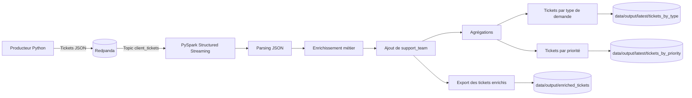

# OC Projet 9 — Gestion de tickets clients avec Redpanda et PySpark

## 1. Objectif du projet

Ce projet est un POC visant à simuler un pipeline de traitement de tickets clients en temps réel.

Les tickets sont générés par un producteur Python, transmis dans un topic Redpanda, puis lus et traités par PySpark Structured Streaming. Les résultats sont ensuite exportés sous forme de fichiers JSON afin de permettre une visualisation ou une analyse ultérieure.

Ce POC répond aux objectifs suivants :

- configurer un broker Redpanda ;
- créer un topic `client_tickets` ;
- produire des tickets clients au format JSON ;
- lire les tickets avec PySpark ;
- enrichir les données avec une équipe support assignée ;
- calculer des agrégations ;
- exporter les résultats dans le dossier `data/output/` ;
- conteneuriser le pipeline avec Docker Compose.

## 2. Architecture du pipeline



## 3. Données générées

Chaque ticket contient les champs suivants :

| Champ | Description |
|---|---|
| `ticket_id` | Identifiant unique du ticket |
| `client_id` | Identifiant du client |
| `created_at` | Date et heure de création |
| `request` | Description de la demande |
| `request_type` | Type de demande |
| `priority` | Priorité du ticket |

Exemple de ticket JSON :

```json
{
  "ticket_id": "TCK-263F20F82DC4",
  "client_id": "CLI-00092",
  "created_at": "2026-05-25T07:58:40.717565+00:00",
  "request": "Problème d'accès aux données",
  "request_type": "technical",
  "priority": "low"
}
```

## 4. Transformations PySpark

Le traitement PySpark réalise les opérations suivantes :

1. lecture du topic Redpanda `client_tickets` ;
2. conversion des messages Kafka en chaînes JSON ;
3. parsing du JSON selon un schéma défini ;
4. ajout d’une colonne `support_team` ;
5. export des tickets enrichis ;
6. agrégation du nombre de tickets par type de demande ;
7. agrégation du nombre de tickets par priorité.

Règles d’assignation des équipes support :

| Type de demande | Équipe assignée |
|---|---|
| `technical` | Support technique |
| `billing` | Support facturation |
| `commercial` | Support commercial |
| `account` | Support compte client |
| `incident` | Cellule incident |

## 5. Arborescence du projet

```text
oc_projet9/
├── compose.yml
├── README.md
├── producer/
│   ├── Dockerfile
│   └── ticket_producer.py
├── redpanda/
│   └── Dockerfile
├── spark/
│   ├── Dockerfile
│   └── ticket_stream_processor.py
├── scripts/
│   └── build_and_run_spark_test.sh
├── data/
│   ├── output/
│   └── checkpoint/
└── docs/
```

## 6. Prérequis

Les outils suivants doivent être installés :

- Docker ;
- Docker Compose ;
- Git ;
- `uv`, uniquement pour les tests locaux hors conteneur.

Le pipeline principal peut être lancé via Docker Compose.

## 7. Lancement complet de la démonstration

Le script suivant permet de nettoyer les sorties précédentes, reconstruire les images Docker, lancer Redpanda, lancer PySpark, produire des tickets et afficher les résultats :

```bash
./scripts/build_and_run_spark_test.sh
```

Ce script exécute les grandes étapes suivantes :

1. nettoyage de `data/output/` et `data/checkpoint/` ;
2. reconstruction des images Docker ;
3. démarrage de Redpanda ;
4. initialisation du topic ;
5. démarrage du processeur PySpark ;
6. lancement du producteur Python ;
7. attente des fichiers de sortie ;
8. affichage des résultats produits.

## 8. Commandes utiles

Démarrer Redpanda :

```bash
docker compose up -d redpanda
```

Créer ou vérifier le topic :

```bash
docker compose up -d redpanda-init
```

Lancer le processeur PySpark :

```bash
docker compose up spark-processor
```

Lancer le producteur de tickets :

```bash
docker compose run --rm producer
```

Consommer manuellement le topic Redpanda :

```bash
docker exec -it redpanda rpk topic consume client_tickets -X brokers=localhost:9092 --num 5
```

Lister les topics :

```bash
docker exec -it redpanda rpk topic list -X brokers=localhost:9092
```

## 9. Fichiers de sortie

Les résultats sont exportés dans le dossier `data/output/`.

| Dossier | Contenu |
|---|---|
| `data/output/enriched_tickets/` | Tickets enrichis avec l’équipe support |
| `data/output/latest/tickets_by_type/` | Nombre de tickets par type de demande |
| `data/output/latest/tickets_by_priority/` | Nombre de tickets par priorité |

Exemple de sortie pour les tickets par type :

```json
{"request_type":"incident","support_team":"Cellule incident","count":57}
{"request_type":"billing","support_team":"Support facturation","count":58}
{"request_type":"account","support_team":"Support compte client","count":62}
{"request_type":"technical","support_team":"Support technique","count":46}
{"request_type":"commercial","support_team":"Support commercial","count":42}
```

## 10. Nettoyage

Arrêter les conteneurs :

```bash
docker compose down
```

Supprimer les volumes Docker associés :

```bash
docker compose down -v
```

Nettoyer les sorties Spark :

```bash
sudo chown -R "$(id -u):$(id -g)" data || true
rm -rf data/output/* data/checkpoint/*
mkdir -p data/output data/checkpoint
```

## 11. Démonstration vidéo

Lien de démonstration :

```text
https://youtu.be/PHfxdLfoGZc
```

La vidéo doit montrer :

1. le lancement du script de démonstration ;
2. le démarrage de Redpanda ;
3. la production des tickets ;
4. le traitement PySpark ;
5. les fichiers générés dans `data/output/` ;
6. l’affichage des agrégations.

## 12. Limites du POC

Ce projet est un POC local. Il ne constitue pas une architecture de production.

Les principales limites sont :

- absence d’authentification Redpanda ;
- absence de chiffrement TLS ;
- cluster Redpanda mono-nœud ;
- absence de supervision avancée ;
- absence de base de données cible ;
- exports JSON locaux uniquement.

Pour une mise en production, il faudrait ajouter la sécurité, la supervision, la haute disponibilité, une politique de rétention et un stockage cible adapté.
